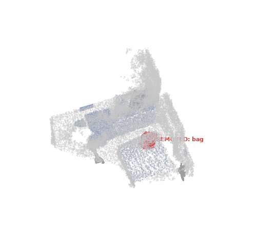
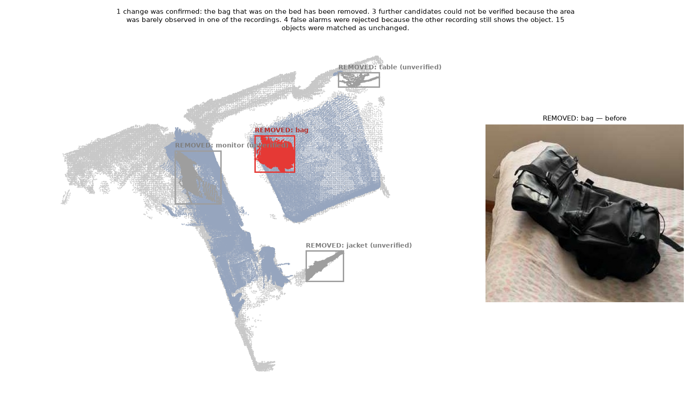

# What changed in the room?

Give it two phone scans of the same room, recorded at different times. It works out, in 3D, which
objects were **removed, added, moved or replaced**. It also tells real changes apart from things
that only *look* different because the camera saw the room from elsewhere or never saw that part.



> Example (`examples/demo`): **"1 change was confirmed: the bag that was on the bed has been
> removed."** 3 further candidates are reported as *could not be verified*, 4 detector false
> alarms are rejected, and 15 objects are matched as unchanged.

---

## 1. Quickstart

Requirements: Linux, an NVIDIA GPU (≥ 24 GB; developed on an L40S), driver ≥ 580, and [uv](https://docs.astral.sh/uv/).

```bash
uv sync                                    # Python 3.12 environment + dependencies
./scripts/download_models.sh               # ~3.7 GB of checkpoints into checkpoints/ (optional: fetched on first use)
uv run python -m changedet.cli all --a path/to/before --b path/to/after --run demo
```

`--a` and `--b` are **Record3D exports**: folders with `rgb/`, `depth/` and `metadata*.json`. You
get them from the Record3D iPhone app (LiDAR) via *Export → EXR + JPG sequence*. Results go
to `runs/demo/`:

| file | what |
|---|---|
| `report/report.md` | human-readable report (summary, table, one sentence per change, evidence images) |
| `report/changes.json` | the same as structured data (`ChangeReport`) |
| `viz/final.rrd` | interactive 3D viewer: `uv run rerun runs/demo/viz/final.rrd` |
| `viz/hero.png`, `viz/hero.gif` | static top-down map and orbit animation |

The whole pipeline takes **about 3 minutes** on an L40S for two ~70 s recordings, and later runs
reuse cached stages. Use `--from c4` to recompute from a given stage onward, `--force` to
recompute everything, and `--set section.key=value` to override any setting in
`configs/default.yaml`. Every stage can also run on its own (`… cli c3 --run demo`).

**Viewing over SSH:** `uv run rerun --web-viewer runs/demo/viz/final.rrd` serves a browser viewer.
Forward its port, or copy the `.rrd` (2 MB) to your laptop and run `rerun final.rrd`.

**Docker:**
```bash
docker build -t changedet .
docker run --gpus all -u "$(id -u):$(id -g)" -e HOME=/tmp \
  -v "$PWD/checkpoints:/app/checkpoints" -v "$PWD/runs:/app/runs" -v /path/to/recordings:/data \
  changedet all --a /data/before --b /data/after --run demo
```

**Sample data:** the two recordings used for `examples/demo` (~640 MB) are not in the repository.
Download: _link to be added_. Unpack them into `vid1/` (before) and `vid2/` (after), then run the
quickstart with `--a vid1 --b vid2`.

---

## 2. Example output

From [`examples/demo/report.md`](examples/demo/report.md) (before = `vid1`, after = `vid2`; the
ground truth is a single removed bag):

| id | change | object | confidence | where |
|---|---|---|---|---|
| chg_000 | **removed** | bag | ✅ confirmed | on the bed |
| chg_001 | **removed** | jacket | ❓ unverified | about 0.3 m from the chair |
| chg_003 | **removed** | monitor | ❓ unverified | on the chest of drawers |
| chg_006 | **removed** | table | ❓ unverified | next to the bed |

> **chg_000** The bag that was on the bed has been removed. Confirmed: 84% of that space was seen
> empty in the second recording.
>
> **chg_006** The table that was next to the bed may have been removed. Could not be verified:
> 55% of that space was never clearly observed in the second recording.



Four more candidates (two picture frames, a "pillow", one jacket) are listed in the report's
appendix as rejected. The other recording still shows a surface where they are.

---

## 3. How it works

```
 before (Record3D)        after (Record3D)
       │                        │
  C1 keyframes             C1 keyframes            sharpest frame per 1/3 s, pose-based de-duplication
       │                        │
       └──────► C2 one metric world ◄──────┘      LiDAR depth + ARKit poses, floor at z = 0, B registered onto A
                        │
  C3 2D masks ──► C4 3D objects (per session)      Grounding DINO + SAM 2 → lifted, fused, CLIP + DINOv2 features
                        │
                C5 match objects A ↔ B              Hungarian on appearance + geometry → moved / removed / added / replaced
                        │
                C6 visibility check                 did the *other* recording look at that space? → confirmed / unverified / rejected
                        │
                C8 report  ·  C10 3D viewer
```

**C1 — Keyframes.** Every frame (~4 000 per recording) is scored for sharpness. The sharpest frame
in each 1/3 s window is kept. Frames much blurrier than their neighbours, and frames taken
without the camera really moving, are dropped. That leaves 100 frames per recording.

**C2 — One shared 3D world.** Record3D provides metric LiDAR depth and ARKit camera poses, so no
learned reconstruction is needed. Each recording has its own origin but the same gravity, so
aligning B to A only means finding a rotation about the vertical plus a translation. An exhaustive
search over rotations (correlating top-down floor plans with an FFT) is followed by a robust
point-to-plane ICP restricted to those four parameters. On the example the remaining error is
2.2 cm, and the floor is within 0.15° of level.

**C3 — What is where (2D).** Grounding DINO finds boxes from an everyday-object vocabulary. Each
box gets the single best-matching word. SAM 2 turns boxes into masks, and masks are made
exclusive so that "a bag on a bed" is two segments.

**C4 — Objects in 3D.** Each mask is lifted to 3D with the depth map. Segments from different
frames are fused when they overlap in 3D and look alike (CLIP). This gives one object per physical
thing per recording, with a label vote, a point cloud, and CLIP/DINOv2 embeddings.

**C5 — Match and classify.** Objects of the two recordings are matched with the Hungarian algorithm.
The cost combines CLIP, DINOv2, distance, size and label, with weights calibrated on the data.
ICP between each matched pair decides whether it stayed, moved or turned. Unmatched objects
become *removed* / *added*, and a removed and an added object in the same spot become
*replaced*.

**C6 — Was it actually observed?** Every candidate's 3D points are projected into all cameras of
the *other* recording and compared with that camera's depth:
- the camera saw **past** the point: the space is empty;
- it saw a surface **at** the point: the space is still occupied;
- otherwise: no information.

A removal is **confirmed** only if the after-recording looked at the space and saw it empty. It
is **rejected** if it saw something there, and **unverified** if it never looked.

**C8 — Report.** One sentence per change, from geometry. Locations come from unchanged landmark
objects ("on the bed", "next to the desk"). Wording follows the confidence ("has been removed" /
"may have been removed" / "seemed to have been removed"), and each sentence quotes its evidence.

**C10 — Viewer.** A rerun recording that opens with a fixed layout: the 3D scene (changes coloured
by type, unchanged objects dimmed, both camera paths), the report, and a "before" photo of each
confirmed change.

---

## 4. Design choices & trade-offs

- **Objects, not points.** Diffing raw point clouds flags every bit of noise, every wrinkled duvet
  and every unseen corner. Diffing *objects* keeps changes meaningful and nameable ("the bag"),
  and lets a moved object be recognised as the same object.
- **Three-way confidence instead of guessing.** A recording that never looked at a spot cannot
  tell you whether something left it. Visibility reasoning makes that explicit, so the system
  says "unverified" instead of inventing a change. It is also what removes most false alarms:
  on the example, 4 of 7 spurious candidates are rejected because the other recording still sees
  them.
- **Phone LiDAR instead of learned reconstruction.** Metric depth and ARKit poses come free with
  Record3D. That removed the riskiest stage (MASt3R/VGGT, scale ambiguity) and made the geometry
  trustworthy: 7–9 mm reprojection consistency within a recording, 1.6 cm across recordings.
- **Gravity-aware registration.** Both recordings know which way is down, so only 4 unknowns
  remain. The exhaustive yaw search needs no initial guess, which makes the alignment robust.
- **Check everything on the real data.** Several rules exist because the real data broke a naive
  version, and each is recorded in [`project_spec.md`](project_spec.md) §12:
  - a glossy TV makes the LiDAR record a full mirror image of the room behind the wall;
  - a photo of people produced "jacket" detections;
  - one recording fused two bottles that the other kept separate.
- **VLM as verifier, not detector** (planned, C7): a vision-language model will only be asked to
  double-check geometric candidates with before/after crops. It will not search for changes
  itself, so it cannot hallucinate new ones.

---

## 5. Evaluation

The automatic evaluation stage (C11) is not built yet. So far there is **one** real recording pair,
with one true change; this is a sanity check, not a benchmark.

| pair | true changes | confirmed | correct confirmed | unverified | rejected false alarms |
|---|---|---|---|---|---|
| `main` (vid1 → vid2) | 1 (bag removed) | 1 | 1 (the bag) | 3 (all spurious) | 4 |

All 13 objects matched one-to-one across recordings are matched correctly, and none is falsely
reported as moved. The synthetic tests (`uv run pytest`, 93 tests) cover every change type,
including rotation in place, identical objects swapping places, and replacements. A
**no-change control recording** is the next thing to add.

---

## 6. Failure modes & limitations

- **Unverified noise.** Objects that one recording detected and the other barely covered end up
  as *unverified* candidates. On the example these are the clothes rail, the bedside table, and a
  TV-reflection fragment. They are clearly flagged, but they are noise.
- **Glossy surfaces.** LiDAR returns a mirror image through TV screens. C4 and C6 filter it
  (masked depth must not lie behind its surroundings; depth under TV/monitor masks is ignored).
  The fused room clouds in the viewer still contain the "mirror room" behind the wall.
- **Background cloud near changes.** The grey "unchanged" background keeps parts of a removed
  object that lie within 5 cm of a surface in the other recording (e.g. the bag's underside on
  the duvet). Only the viewer uses it.
- **Labels.** The open-vocabulary detector calls the TV a "monitor" and the bedside table a
  "table", and occasionally splits furniture. Matching relies mostly on appearance and position
  for this reason.
- **Input.** Only Record3D exports are supported; plain `.mp4` needs the learned-reconstruction
  path (TODO). Tested on one room.

## 7. With more time

- C7: VLM verification of candidates with before/after crops; this should clear most *unverified*
  noise.
- C9: navigation impact (occupancy grid diff + path re-planning).
- C11: evaluation over a no-change control and a "hard" pair (a change hidden behind furniture).
- C8 full: LLM-written sentences grounded in the same spatial facts.
- Plain video input via MASt3R/VGGT; masking glossy surfaces in the fused clouds as well.

## 8. Recording tips

- Use Record3D (iPhone/iPad with LiDAR) and export as **EXR + JPG**.
- Pan slowly and cover every surface you care about in **both** recordings. The system will
  (correctly) refuse to confirm changes in places the second recording did not look at.
- Walk a slightly different path the second time; that is fine. Stay within ~3 m of objects
  (LiDAR range).
- Avoid pointing straight at TVs, mirrors and windows for long.

---

## Repository layout

```
changedet/            the package: cli.py, models.py, export.py, core/ (types, config, cache, geometry), io/, stages/c*_*.py
configs/default.yaml  every threshold and model choice
tests/                pytest suite (synthetic data; real-data/model tests skip when unavailable)
examples/demo/        committed example outputs
project_spec.md       full specification, decisions log, per-stage results
```
