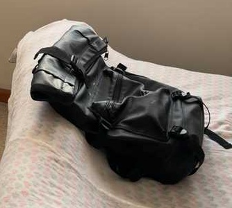
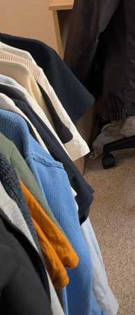
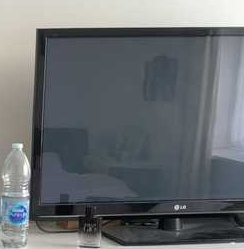
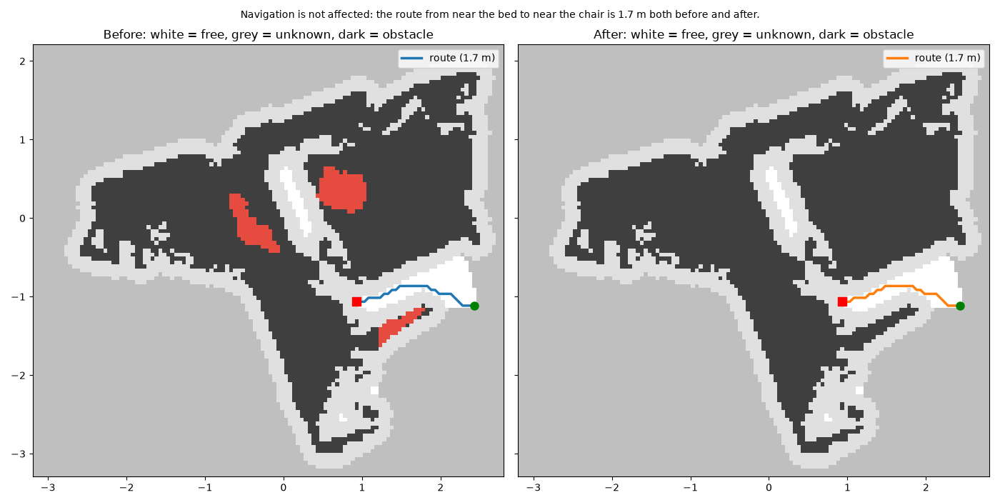

# What changed in the room? — run `demo`

Comparing the two recordings found one confirmed change: the black backpack on the bed is gone. Two other possible removals, a jacket near the chair and a monitor on the chest of drawers, could not be verified because much of their space was not clearly observed in the second recording. Five false alarms were rejected and 15 objects were unchanged.

## Changes

| id | change | object | confidence | where | movement | objects (A → B) |
|---|---|---|---|---|---|---|
| chg_000 | **removed** | bag | ✅ confirmed | on the bed |  | A_011 |
| chg_001 | **removed** | jacket | ❓ unverified | about 0.3 m from the chair |  | A_016 |
| chg_003 | **removed** | monitor | ❓ unverified | on the chest of drawers |  | A_017 |

### chg_000: bag removed

The black backpack that rested on the bed, to the right of the chest of drawers (as seen from the recording position), has been removed; 84% of its space was seen empty in the second recording.

Spatial facts the sentence is based on

- chg_000: REMOVED bag (the visual check calls it: black backpack). Confidence: confirmed.
  Evidence: Confirmed: 84% of that space was seen empty in the second recording. A visual check of before/after images agrees (confidence 0.88).
  Before: rests on the bed; next to the chest of drawers, to the right of the chest of drawers (as seen from where the recordings were made); 0.7 m from the nearest wall; size 0.6 x 0.6 x 0.2 m.

### chg_001: jacket removed

A black jacket about 0.2 m above the floor, in front of the chair and the bed (as seen from the recording position), may have been removed, but this could not be verified because 42% of its space was never clearly observed in the second recording. A visual check suggests nothing changed, since dark jackets appear in both recordings.

Spatial facts the sentence is based on

- chg_001: REMOVED jacket (the visual check calls it: black jacket). Confidence: unverified.
  Evidence: Could not be verified: 42% of that space was never clearly observed in the second recording. A visual check suggests nothing changed (confidence 0.75, below the threshold to reject): The dark jackets on the clothes rack and draped over the desk chair appear in both recordings, so the jacket was not removed.
  Before: 0.2 m above the floor; about 0.3 m from the chair, in front of the chair (as seen from where the recordings were made); about 0.4 m from the bed, in front of the bed (as seen from where the recordings were made); 1.2 m from the nearest wall; size 0.6 x 0.5 x 0.7 m.

### chg_003: monitor removed

A monitor on the chest of drawers, to the right of another monitor (as seen from the recording position), may have been removed, but this could not be verified because 87% of its space was never clearly observed in the second recording.

Spatial facts the sentence is based on

- chg_003: REMOVED monitor. Confidence: unverified.
  Evidence: Could not be verified: 87% of that space was never clearly observed in the second recording.
  Before: rests on the chest of drawers; next to another monitor, to the right of another monitor (as seen from where the recordings were made); 0.0 m from the nearest wall; size 0.7 x 0.8 x 0.7 m.

## Unchanged objects

bed, bottle, chair, chest of drawers, computer tower, keyboard, monitor, picture frame

## Appendix: rejected candidates

| id | change | object | confidence | where | movement | objects (A → B) |
|---|---|---|---|---|---|---|
| chg_002 | **removed** | jacket | ✖ rejected | next to the chair |  | A_020 |
| chg_004 | **removed** | picture frame | ✖ rejected | next to another picture frame |  | A_018 |
| chg_005 | **removed** | picture frame | ✖ rejected | next to another picture frame |  | A_019 |
| chg_006 | **removed** | table | ✖ rejected | next to the bed |  | A_021 |
| chg_007 | **added** | pillow | ✖ rejected | next to the keyboard |  | B_013 |

- **chg_002** The jacket that was next to the chair seemed to have been removed. Rejected: the second recording still shows a surface in 50% of that space, so the object is most likely still there.
- **chg_004** The picture frame that was next to another picture frame seemed to have been removed. Rejected: the second recording still shows a surface in 100% of that space, so the object is most likely still there.
- **chg_005** The picture frame that was next to another picture frame seemed to have been removed. Rejected: the second recording still shows a surface in 100% of that space, so the object is most likely still there.
- **chg_006** The table that was next to the bed seemed to have been removed. Rejected by a visual check of before/after images (confidence 0.90): The white bedside table with the Rubik's cube and water bottle on it is still clearly present beside the bed in the second image, so it was not removed.
- **chg_007** A new pillow seemed to have appeared next to the keyboard. Rejected: the first recording still shows a surface in 100% of that space, so the object is most likely still there.

## Navigation impact

Navigation is not affected: the route from near the bed to near the chair is 1.7 m both before and after.

- route: near the bed → near the chair; before 1.69 m, after 1.69 m
- robot radius 0.2 m, height 1.2 m; walkable area before 0.6 m², after 0.6 m²
- blocking changes: none

## Run information

- change list: `changes/changes_verified.json`
- objects: 22 before, 14 after
- before/after alignment RMSE: 2.2 cm
- report sentences: llm (claude-opus-5-5), 3/3 sentences
- warnings: no VLM verdict for chg_003 (no credentials or no view)
