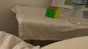

# What changed in the room? — run `demo`

1 change was confirmed: the bag that was on the bed has been removed. 3 further candidates could not be verified because the area was barely observed in one of the recordings. 4 false alarms were rejected because the other recording still shows the object. 15 objects were matched as unchanged.

## Changes

| id | change | object | confidence | where | movement | objects (A → B) |
|---|---|---|---|---|---|---|
| chg_000 | **removed** | bag | ✅ confirmed | on the bed |  | A_011 |
| chg_001 | **removed** | jacket | ❓ unverified | about 0.3 m from the chair |  | A_016 |
| chg_003 | **removed** | monitor | ❓ unverified | on the chest of drawers |  | A_017 |
| chg_006 | **removed** | table | ❓ unverified | next to the bed |  | A_021 |

### chg_000: bag removed

The bag that was on the bed has been removed. Confirmed: 84% of that space was seen empty in the second recording.

### chg_001: jacket removed

The jacket that was about 0.3 m from the chair may have been removed. Could not be verified: 42% of that space was never clearly observed in the second recording.

### chg_003: monitor removed

The monitor that was on the chest of drawers may have been removed. Could not be verified: 87% of that space was never clearly observed in the second recording.

### chg_006: table removed

The table that was next to the bed may have been removed. Could not be verified: 55% of that space was never clearly observed in the second recording.

## Unchanged objects

bed, bottle, chair, chest of drawers, computer tower, keyboard, monitor, picture frame

## Appendix: rejected candidates

| id | change | object | confidence | where | movement | objects (A → B) |
|---|---|---|---|---|---|---|
| chg_002 | **removed** | jacket | ✖ rejected | next to the chair |  | A_020 |
| chg_004 | **removed** | picture frame | ✖ rejected | next to another picture frame |  | A_018 |
| chg_005 | **removed** | picture frame | ✖ rejected | next to another picture frame |  | A_019 |
| chg_007 | **added** | pillow | ✖ rejected | next to the keyboard |  | B_013 |

- **chg_002** The jacket that was next to the chair seemed to have been removed. Rejected: the second recording still shows a surface in 50% of that space, so the object is most likely still there.
- **chg_004** The picture frame that was next to another picture frame seemed to have been removed. Rejected: the second recording still shows a surface in 100% of that space, so the object is most likely still there.
- **chg_005** The picture frame that was next to another picture frame seemed to have been removed. Rejected: the second recording still shows a surface in 100% of that space, so the object is most likely still there.
- **chg_007** A new pillow seemed to have appeared next to the keyboard. Rejected: the first recording still shows a surface in 100% of that space, so the object is most likely still there.

## Run information

- change list: `changes/changes_vis.json`
- objects: 22 before, 14 after
- before/after alignment RMSE: 2.2 cm
- warnings: used changes/changes_vis.json (later stages not run)
